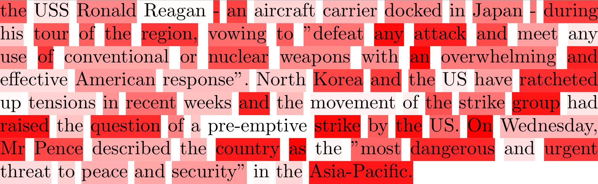
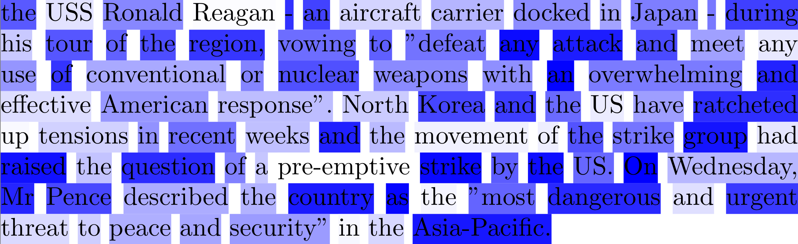
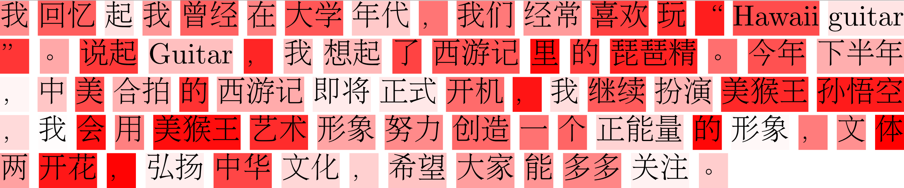

# TAHV：Text Attention Heatmap Visualization

This repository provides a simple visualization tool for the attention based NLP tasks. 

Many attention based NLP tasks visualize the text with attention weights as background. This code takes word list and the corresponding weights as input and generate the Latex code to visualize the attention based text. The Latex code will generates a standalone `.pdf` visulization file. Users can use this `.pdf` visulization file as vector diagram to demonstrate the attention ability of the model in their papers/slides/demos.

## Usage

It is very simple to use this code. Feed the word list and weight list in function `generate` with output Latex file directory and color configuration. The Latex file will be generated. Then compile the Latex file, the `.pdf` file will be generated.

* Notice the weight range: [0-100]

## Citation:   

This repository will be part of new [NCRF++](https://github.com/jiesutd/NCRFpp). Please cite our [ACL demo paper](https://arxiv.org/abs/1806.05626) if you use this code.

    @inproceedings{yang2018ncrf,  
     title={NCRF++: An Open-source Neural Sequence Labeling Toolkit},  
     author={Yang, Jie and Zhang, Yue},  
     booktitle={Proceedings of the 56th Annual Meeting of the Association for Computational Linguistics},
     Url = {http://aclweb.org/anthology/P18-4013},
     year={2018}  
    }

## Update
* 2019-Apr-12, support Chinese
* 2019-Apr-01, init version

